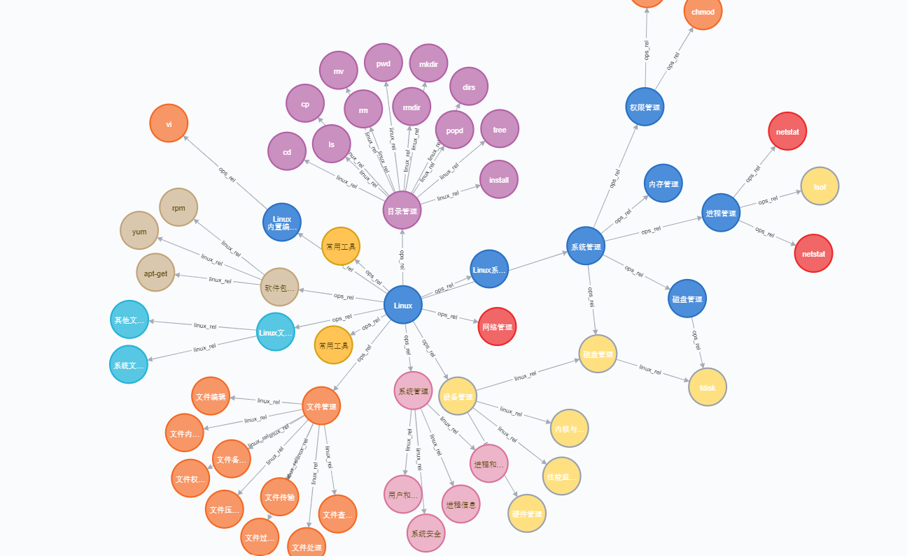

# Linux-Knowledge-Graph
Knowledge Graph for Linux based on Triples and Neo4j

**Including 401 entities and 377 relationships for now**.

More data will be added in the future.

## Linux KG
These folders contain entities and relationships for **Linux** stored in csv.

Original data is in [LinuxKG.xlsx](LinuxKG.xlsx).

|file name|description|length|
|:-----:|:----:|:----:|
|e_LinuxDir.csv|Linux directory|34|
|e_system.csv|command for system|54|
|e_device.csv|command for device|14|
|e_dir.csv|command for directory|13|
|e_file.csv|command for file|40|
|e_network.csv|command for network|38|
|e_software.csv|command for software|4|
|e_tool.csv|command for tool|4|
|r_linux.csv|relationships|182|

## Ops KG
These folders contain entities and relationships for **Linux operation and maintenance** stored in csv.

Original data is in [opKG.xlsx](opKG.xlsx).

|file name|description|length|
|:-----:|:----:|:----:|
|e_ops.csv|operation and maintenance entities|200|
|r_ops.csv|relationships|195|

## Import to Neo4j

Move all .csv files to Neo4j **import** directory.

Then execute the [CYPHER](Cypher4Neo4j.txt) code in the Neo4j console.

